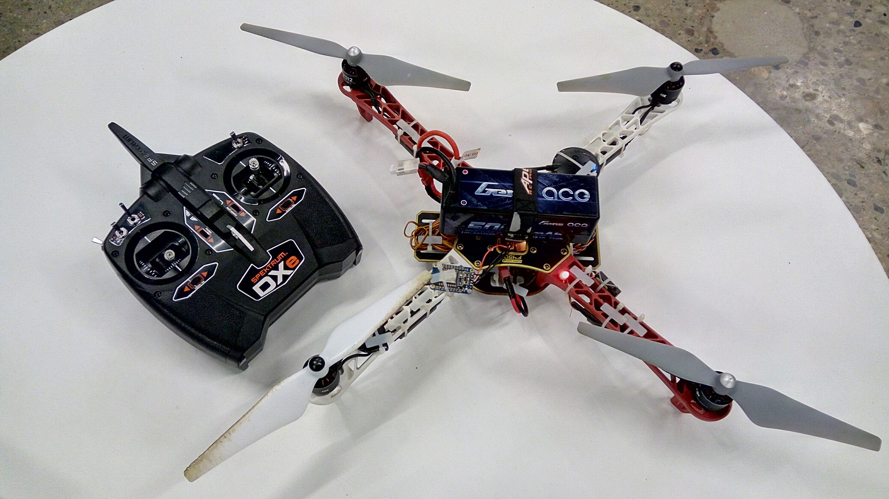
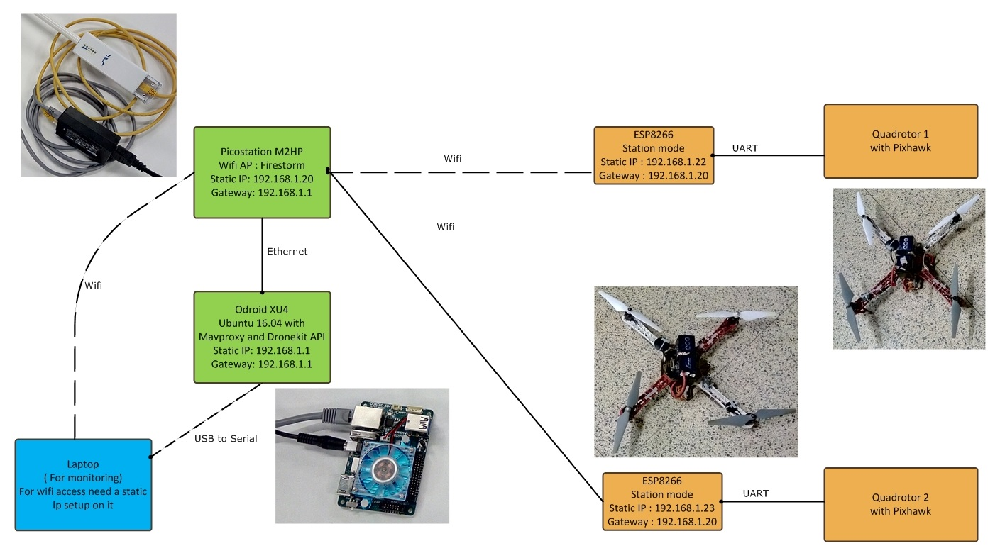

AUTONOMOUS AIR TRAFFIC CONTROLLER
============

**University of Pennsylvania, ESE 519: Real Time and Embedded Systems**

* Prateek Singhal
* Karan Modi
* Nitesh Singh
* [Blog](https://devpost.com/software/autonomous-air-traffic-controller-pg62u5)
* [Report](FinalReport_Firestorm_AATC.pdf)
* [Video](https://www.youtube.com/watch?v=zIQvVEkTA7I&list=PLuWLqb5ctXWFwknlIJluRaV9K4BDzSD1n&index=22)
* [Code](https://github.com/modi-karan/Autonomous-Air-Traffic-Controller)

### Note
We moved our Git repository to [here](https://github.com/modi-karan/Autonomous-Air-Traffic-Controller) due to permissions problems. That is the updated repository and hosts all our files.

### DESCRIPTION AND GOALS

Description: Autonomous ATC will coordinate several quadrotors trying to simulate a TRACON environment. The quadrotors will be asked to follow a preset series of waypoints. Goal is to also establish communication giving commands similar to ATC directives like holding, new routing etc.

Goals: For the project, Autonomous ATC will simulate following situations :
* Sequential take-off and landing
* Parallel take-off and landing
* Emergency landings

### VIDEO

### IMAGES and GIFs

### BUILD INSTRUCTIONS
* To work with this code you need to first install Mavproxy and dronekit on your computer. The link for it is given below:
* http://python.dronekit.io/develop/installation.html
* Clone this repository on your computer.
* Change directory to the cloned directory and then type
* pyhton filename
* for example
* python four_quad_final.py
