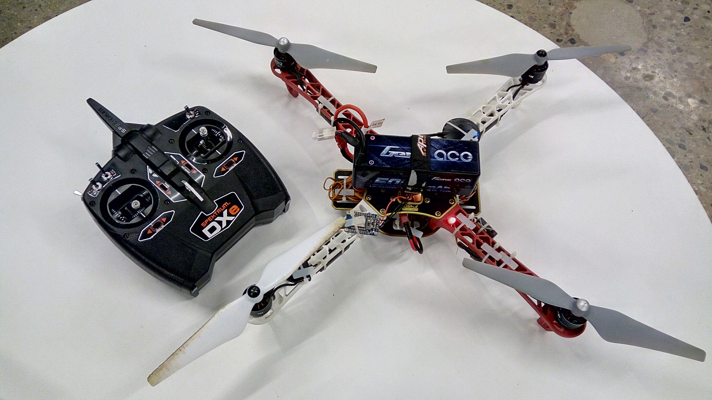
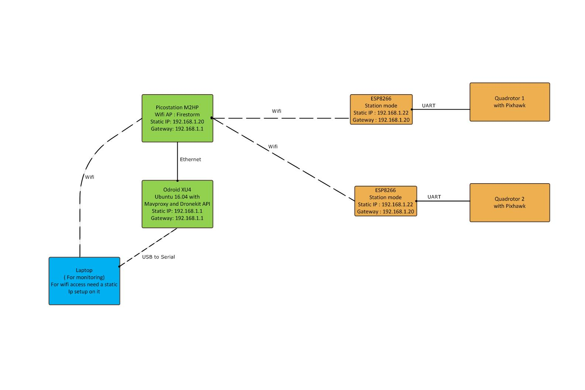
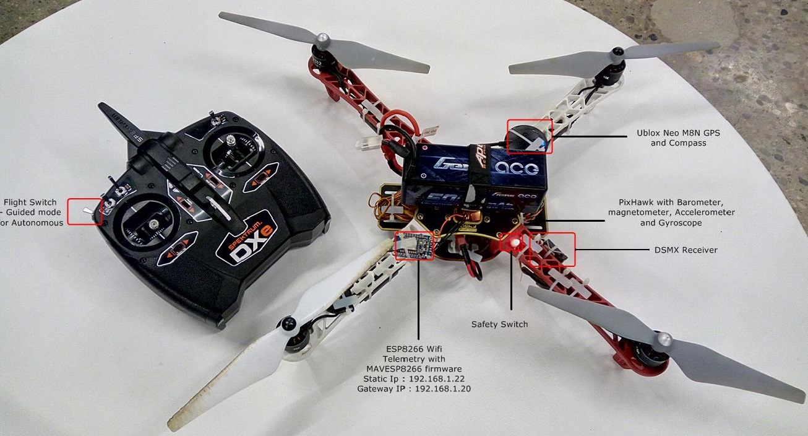
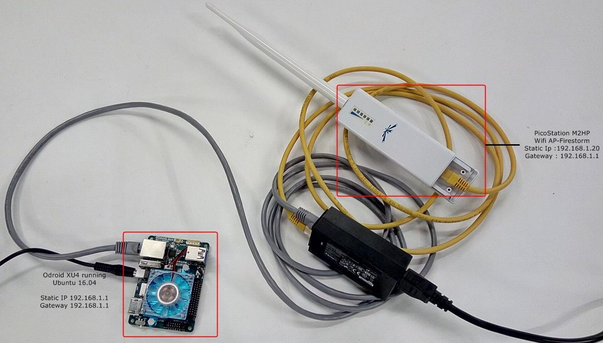

AUTONOMOUS AIR TRAFFIC CONTROLLER
============

**University of Pennsylvania, ESE 519: Real Time and Embedded Systems**

* Prateek Singhal
* Karan Modi
* Nitesh Singh
* [Blog](https://devpost.com/software/autonomous-air-traffic-controller-pg62u5)

### DESCRIPTION AND GOALS

Description: Autonomous ATC will coordinate several quadrotors trying to simulate a TRACON environment. The quadrotors will be asked to follow a preset series of waypoints. Goal is to also establish communication giving commands similar to ATC directives like holding, new routing etc.

Goals: For the project, Autonomous ATC will simulate following situations :
a. Sequential take-off and landing
b. Parallel take-off and landing
c. Emergency landings

### VIDEO

### IMAGES and GIFs
Add images and screenshot of your product, user iterface, etc. Animated GIFs of User interfaces would be preferred.

### BUILD INSTRUCTIONS
To work with this code you need to first install Mavproxy and dronekit on your computer. The link for it is given below:
http://python.dronekit.io/develop/installation.html
Clone this repository on your computer.
Change directory to the cloned directory and then type
pyhton filename
for example
python four_quad_final.py
